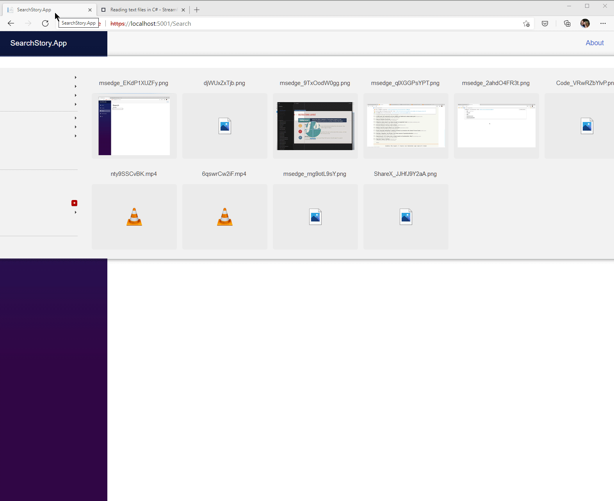

# Search Story

Lucene based history searcher.

There are two use cases:

1. Upload files from your local machine to be indexed by lucene.

    If the files are text based (markdown, text, etc), or they are PDF files, they will be indexed properly.
    In the future, using [pandoc] to convert everything to markdown (word etc.) may more sustainable.
    I see this being used to index something like a zotero folder to search research papers you have read.

    I (and my one user...) provide the path to our [zotero] citation library to get full text search over all of the research articles we read.

2. Using the inclulded browser extension, save a "text only" version of the page to the lucene index.

    I see this being the main use case - any time you read an interesting thing, hit a shortcut and index the entire text content.
    This let's you have full text search and a full copy of every interesting page you read.

## Development Ideas

- [in progress] Browser extension
    - [x] Uses [readability] to parse and save a readable page view
    - [x] Posts data to backend
    - [ ] Published in chrome store
    - [x] Visual feedback on article save
    - [ ] Pull video transcripts?
- [in progress] Cross platform app
    - [x] Build for windows & linux
    - [x] Writes to appropriate temporary directories
    - [x] True single-file exectuable
    - [ ] Close to system tray / run in background
        
        May require hosting as a "real app" rather than console. Or at least a powershell wrapper for windows.

[pandoc]: https://pandoc.org/using-the-pandoc-api.html
[readability]: https://github.com/mozilla/readability
[zotero]: https://www.zotero.org/